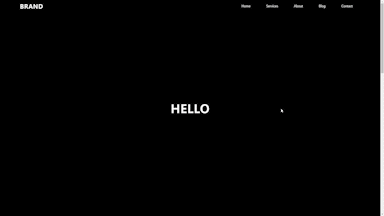

# 💻 Clock UI

자바스크립트를 실제 프로그램 개발에 적용해보기 위한 UI 프로젝트 입니다.

## 📸 App View

<p align="center"></p>

## 🧑‍💻 새로 배운 것

- toggle()

  HTML element에 class name이 존재하는지 확인한다. 만약 class name이 존재한다면 toggle은 class name을 제거하고, class name이 존재하지 않는다면 class name을 추가한다.

  ```javascript
  const btn = document.querySelector("button");

  btn.addEventListener("click", () => {
    btn.classList.toggle("clicked");
  });

  // 버튼을 클릭할 때마다 button element에 'clicked' class가 표시, 삭제를 반복한다.
  ```

## ✍🏻 참고 자료

- [JS classList](https://developer.mozilla.org/ko/docs/Web/API/Element/classList)
