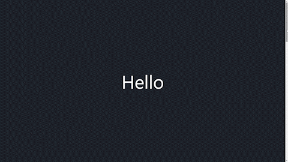

# 💻 Clock UI

자바스크립트를 실제 프로그램 개발에 적용해보기 위한 UI 프로젝트 입니다.

## 📸 App View

<p align="center"></p>

## 🧑‍💻 새로 배운 것

- Window 객체

  ① 일반적으로 브라우저의 창(browser window)을 의미하고, 이를 제어하는 다양한 메서드를 제공한다.

  ```javascript
  function handleWindowResize() {
    document.body.style.backgroundColor = "red";
  }

  window.addEventListener("resize", handleWindowResize);

  // 브라우저 창의 크기를 변경하면 배경이 빨간색으로 바뀐다.
  ```

  ② 브라우저 안의 모든 요소들이 소속된 객체로, 최상위에 있기 때문에 어디서든 접근이 가능하다고 해서 '전역 객체'라고도 부른다.

## ✍🏻 참고 자료

- [JS Window Interface](https://developer.mozilla.org/ko/docs/Web/API/Window)
- [CSS Media Query](https://developer.mozilla.org/ko/docs/Web/CSS/@media)
