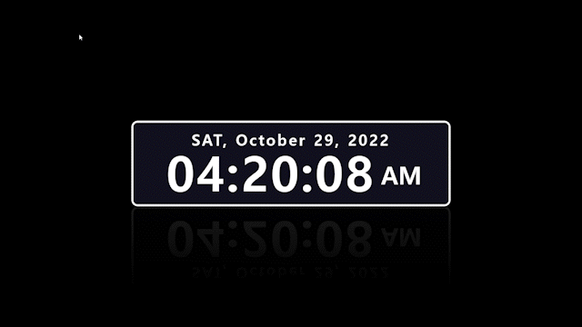

# 💻 Clock UI

자바스크립트를 실제 프로그램 개발에 적용해보기 위한 UI 프로젝트 입니다.

## 📸 App View

<p align="center"></p>

## 🧑‍💻 새로 배운 것

- padStart() : 현재 문자열의 시작을 다른 문자열로 채워, 주어진 길이를 만족하는 새로운 문자열을 반환한다.
  ```javascript
  const str = "5";
  console.log(str.padStart(2, "0"));
  // output: "05"
  ```

## ✍🏻 참고 자료

- [JS Date](https://developer.mozilla.org/ko/docs/Web/JavaScript/Reference/Global_Objects/Date)
- [JS padStart](https://developer.mozilla.org/ko/docs/Web/JavaScript/Reference/Global_Objects/String/padStart)
